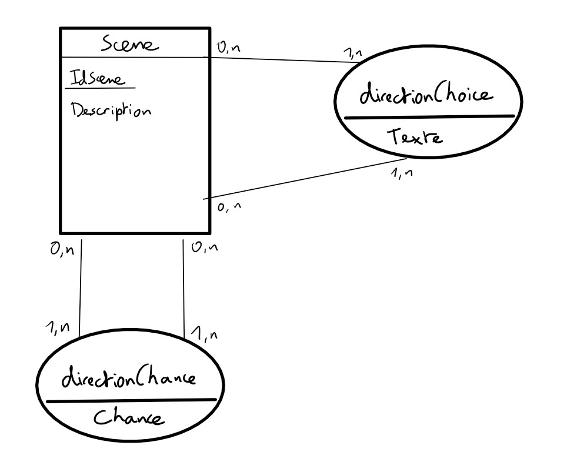

# Ce projet n'étant pas terminé, le scénario actuel ne sert que d'exemple pour tester le code

# gamebook

Ce projet est un jeu dont on est le héros, basé sur les livres dont on est le héros. Pour plus de détails, consulter [livre dont vous êtes le héros | Wikipédia](https://fr.wikipedia.org/wiki/Un_livre_dont_vous_%C3%AAtes_le_h%C3%A9ros)

***

## Comment lancer le jeu ?

* Pour lancer ce jeu vous aurez besoin d'un **logiciel permettant l'utilisation d'une base de données**. Le script de la base de données contenant le scénario du jeu est dans le fichier *scriptBD.sql*, présent dans le dossier *bd*. Vous devrez ensuite modifier si besoin les valeurs des attributs *url*, *user* et *password* dans la classe *Jeu* définie dans le package *jeu*, et ce pour correspondre à **vos paramètres**

* Vous aurez besoin d'un logiciel pouvant faire tourner un **projet java**

* Une fois que tout est en place, lancer la classe *Application* qui se trouve dans le package *appli*

***

Ci-dessous le schéma correspondant à la base de données :

